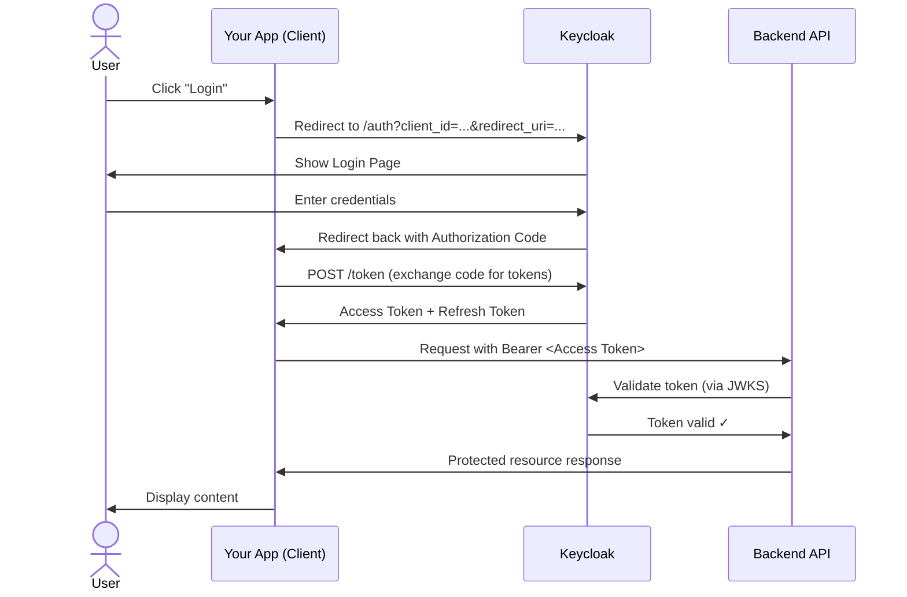
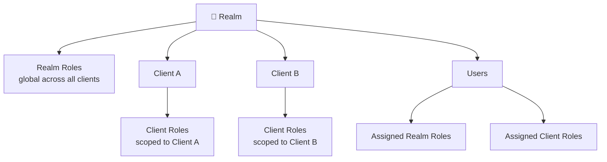
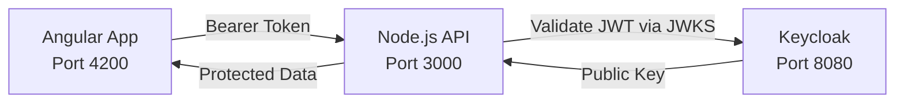
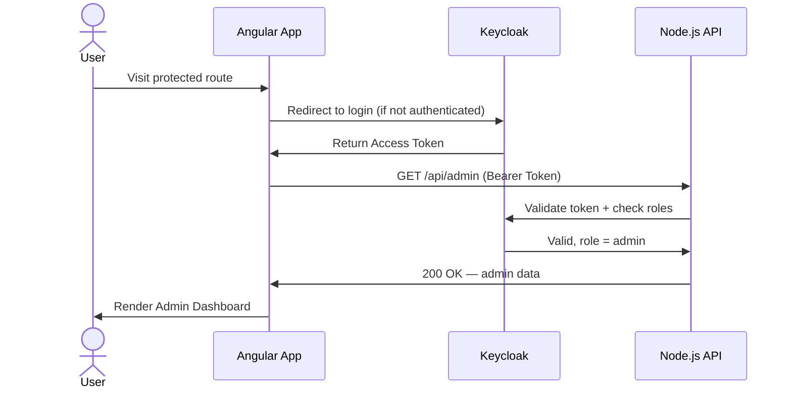

# Keycloak — Complete Guide

A structured, hands-on course covering Keycloak from fundamentals to a complete, production-ready **Angular + Node.js** application with full authentication and Role-Based Access Control (RBAC).

---

## Table of Contents

- [Module 1: Introduction to Keycloak](#module-1-introduction-to-keycloak)
- [Module 2: Setup & Installation](#module-2-setup--installation)
- [Module 3: Authentication Basics](#module-3-authentication-basics)
- [Module 4: Authorization & RBAC](#module-4-authorization--rbac)
- [Module 5: Backend Integration (Node.js + Express)](#module-5-backend-integration-nodejs--express)
- [Module 6: Frontend Integration (Angular)](#module-6-frontend-integration-angular)
- [Module 7: Advanced Topics](#module-7-advanced-topics)

---

## Module 1: Introduction to Keycloak

A conceptual overview of Keycloak and why it exists.

### Topics

- **What is Keycloak?** — Open-source Identity and Access Management (IAM) solution by Red Hat
- **Why not build auth from scratch?** — Complexity of OAuth2, OIDC, session management, MFA, and security vulnerabilities make DIY auth risky and expensive
- **Real-world usage** — Enterprise SSO, microservices auth, B2B portals, SaaS platforms
- **Architecture overview** — Realms, Clients, Users, Identity Providers, and Token flows

---

## Module 2: Setup & Installation

Get Keycloak running locally and understand the admin UI.

### Topics

- **Run Keycloak using Docker**

  ```bash
    docker run -p 8080:8080 \
    -e KC_BOOTSTRAP_ADMIN_USERNAME=admin \
    -e KC_BOOTSTRAP_ADMIN_PASSWORD=admin \
    quay.io/keycloak/keycloak:latest start-dev
  ```

- **Basic UI walkthrough** — Navigate the Admin Console to manage realms, users, clients, roles, and identity providers. Explore built-in themes, session management, and event logging.
- **Core concepts**
  - **Realms** — The top-level organizational unit in Keycloak. Each realm is a fully isolated environment with its own users, clients, roles, and configuration. Think of it as a tenant — you might have a `dev` realm, a `staging` realm, and a `production` realm, or separate realms for different products.
  - **Users** — The identities within a realm. Users can be created manually in Keycloak, imported from an LDAP/Active Directory, or registered via social login. Each user has credentials, attributes, and role assignments.
  - **Clients** — Represent applications that interact with Keycloak for authentication. A client can be a frontend SPA, a mobile app, or a backend service. Clients define redirect URIs, token settings, and which roles they expose.

---

## Module 3: Authentication Basics

Understand how login flows work and how to manage users and roles.

### Topics

- **Login flow** — Authorization Code Flow, redirect to Keycloak, token issuance
- **Users & Roles** — Creating users, assigning credentials, and defining roles
- **Realm vs Client roles**
  - **Realm roles** — Global across all clients in the realm
  - **Client roles** — Scoped to a specific client/application
- **Demo: Create users & roles** — Step-by-step through the Admin UI

### Authorization Code Flow



### Role Hierarchy



---

## Module 4: Authorization & RBAC

Implement Role-Based Access Control and understand Keycloak token structure.

### Topics

- **Role-based access control (RBAC)** — Map realm/client roles to API permissions
- **Secure APIs** — Enforce role checks at the resource server level
- **Token structure**
  - **Access Token** — Short-lived JWT containing user claims and roles
  - **Refresh Token** — Long-lived token used to obtain new access tokens without re-login

### Sample Access Token Payload

```json
{
  "sub": "user-uuid",
  "realm_access": {
    "roles": ["admin", "user"]
  },
  "resource_access": {
    "my-client": {
      "roles": ["read", "write"]
    }
  },
  "exp": 1713000000
}
```

---

## Module 5: Backend Integration (Node.js + Express)

Build a secure Node.js REST API that validates Keycloak tokens and enforces role-based access control.

> **USP Module** — This is the most in-demand real-world integration pattern.

### Topics

- **Project setup** — Express app with Keycloak middleware
- **Bearer token validation** — Verify JWTs issued by Keycloak using JWKS
- **Role-based API access** — Protect routes per role (`admin`, `user`, etc.)
- **Full app flow** — Angular frontend → Node.js API → Keycloak

### Full-Stack Architecture



### Install Dependencies

```bash
npm install express keycloak-connect express-session dotenv
```

### `server.js`

```js
const express = require('express');
const session = require('express-session');
const Keycloak = require('keycloak-connect');

const app = express();
const memoryStore = new session.MemoryStore();

app.use(session({
  secret: process.env.SESSION_SECRET,
  resave: false,
  saveUninitialized: true,
  store: memoryStore
}));

const keycloak = new Keycloak({ store: memoryStore }, {
  realm: 'my-realm',
  'auth-server-url': 'http://localhost:8080',
  'ssl-required': 'external',
  resource: 'node-client',
  'confidential-port': 0
});

app.use(keycloak.middleware());

// Public route
app.get('/api/public', (req, res) => {
  res.json({ message: 'Public endpoint — no auth required' });
});

// Authenticated users only
app.get('/api/profile', keycloak.protect(), (req, res) => {
  res.json({ message: 'Your profile', user: req.kauth.grant.access_token.content });
});

// Admin role only
app.get('/api/admin', keycloak.protect('realm:admin'), (req, res) => {
  res.json({ message: 'Admin dashboard — restricted access' });
});

app.listen(3000, () => console.log('API running on http://localhost:3000'));
```

### Role-Based Route Summary

| Route | Protection | Required Role |
|---|---|---|
| `GET /api/public` | None | — |
| `GET /api/profile` | Authenticated | Any logged-in user |
| `GET /api/admin` | Role-checked | `admin` realm role |

---

## Module 6: Frontend Integration (Angular)

Build the Angular side of the complete full-stack app — login, token management, role-based route guards, and secure HTTP calls to the Node.js API.

### Topics

- **Install & configure `keycloak-angular`** — Initialize Keycloak before the app bootstraps
- **Token handling** — Automatically attach `Bearer` tokens to outgoing HTTP requests
- **Route protection** — Auth guards to restrict pages by authentication and role
- **Role-based UI** — Show/hide UI elements based on user roles
- **Token refresh** — Handle silent token refresh to keep sessions alive

### Install Dependencies

```bash
npm install keycloak-angular keycloak-js
```

### `app.config.ts` — Initialize Keycloak at startup

```typescript
import { APP_INITIALIZER, ApplicationConfig } from '@angular/core';
import { KeycloakService } from 'keycloak-angular';

function initializeKeycloak(keycloak: KeycloakService) {
  return () =>
    keycloak.init({
      config: {
        url: 'http://localhost:8080',
        realm: 'my-realm',
        clientId: 'angular-client'
      },
      initOptions: {
        onLoad: 'check-sso',
        silentCheckSsoRedirectUri: window.location.origin + '/assets/silent-check-sso.html'
      }
    });
}

export const appConfig: ApplicationConfig = {
  providers: [
    KeycloakService,
    {
      provide: APP_INITIALIZER,
      useFactory: initializeKeycloak,
      multi: true,
      deps: [KeycloakService]
    }
  ]
};
```

### Auth Guard (route protection)

```typescript
import { Injectable } from '@angular/core';
import { ActivatedRouteSnapshot, CanActivate, Router } from '@angular/router';
import { KeycloakAuthGuard, KeycloakService } from 'keycloak-angular';

@Injectable({ providedIn: 'root' })
export class AuthGuard extends KeycloakAuthGuard {
  constructor(router: Router, keycloak: KeycloakService) {
    super(router, keycloak);
  }

  async isAccessAllowed(route: ActivatedRouteSnapshot): Promise<boolean> {
    if (!this.authenticated) {
      await this.keycloakAngular.login();
      return false;
    }

    const requiredRoles: string[] = route.data['roles'] ?? [];
    return requiredRoles.every(role => this.roles.includes(role));
  }
}
```

### Route Config with Role-Based Guards

```typescript
export const routes: Routes = [
  { path: '', component: HomeComponent },
  {
    path: 'profile',
    component: ProfileComponent,
    canActivate: [AuthGuard]
  },
  {
    path: 'admin',
    component: AdminComponent,
    canActivate: [AuthGuard],
    data: { roles: ['admin'] }   // only users with 'admin' role
  }
];
```

### HTTP Interceptor — Auto-attach Bearer Token

```typescript
import { HttpInterceptorFn } from '@angular/common/http';
import { inject } from '@angular/core';
import { KeycloakService } from 'keycloak-angular';

export const authInterceptor: HttpInterceptorFn = async (req, next) => {
  const keycloak = inject(KeycloakService);
  const token = await keycloak.getToken();

  const authReq = req.clone({
    setHeaders: { Authorization: `Bearer ${token}` }
  });
  return next(authReq);
};
```

### Role-Based UI Elements

```typescript
// In any component
export class NavComponent {
  isAdmin = false;

  constructor(private keycloak: KeycloakService) {
    this.isAdmin = this.keycloak.isUserInRole('admin');
  }
}
```

```html
<nav>
  <a routerLink="/profile">Profile</a>
  <a routerLink="/admin" *ngIf="isAdmin">Admin Panel</a>
  <button (click)="keycloak.logout()">Logout</button>
</nav>
```

### Full-Stack Request Flow



---

## Module 7: Advanced Topics

Production patterns, token lifecycle management, and troubleshooting.

### Topics

- **Keycloak with Docker Compose** — Multi-service setup with a persistent database (PostgreSQL)

  ```yaml
  services:
    postgres:
      image: postgres:15
      environment:
        POSTGRES_DB: keycloak
        POSTGRES_USER: keycloak
        POSTGRES_PASSWORD: secret

    keycloak:
      image: quay.io/keycloak/keycloak:latest
      command: start-dev
      environment:
        KC_DB: postgres
        KC_DB_URL: jdbc:postgresql://postgres/keycloak
        KC_DB_USERNAME: keycloak
        KC_DB_PASSWORD: secret
        KC_BOOTSTRAP_ADMIN_USERNAME: admin
        KC_BOOTSTRAP_ADMIN_PASSWORD: admin
      ports:
        - "8080:8080"
      depends_on:
        - postgres
  ```

- **Production considerations**
  - Use `start` (not `start-dev`) with HTTPS enabled
  - Store secrets in a secrets manager (not environment variables)
  - Configure session timeouts and brute force protection
  - Enable audit logging

- **Token expiry & refresh flow**
  1. Client receives `access_token` (short TTL) and `refresh_token`
  2. On 401, client posts `refresh_token` to `/token` endpoint
  3. Keycloak returns new `access_token`
  4. On `refresh_token` expiry, user must re-authenticate

- **Basic troubleshooting**
  - `401 Unauthorized` — Token expired or invalid issuer URI
  - `403 Forbidden` — User lacks required role; check role mappings
  - Token not containing roles — Ensure role mappers are configured on the client
  - Clock skew issues — Sync server time with NTP

---

## Prerequisites

- Basic understanding of REST APIs
- Java / Spring Boot knowledge (for Module 5)
- Docker installed locally

## Resources

- [Keycloak Official Documentation](https://www.keycloak.org/documentation)
- [Keycloak on GitHub](https://github.com/keycloak/keycloak)
- [Spring Security OAuth2 Resource Server](https://docs.spring.io/spring-security/reference/servlet/oauth2/resource-server/index.html)
